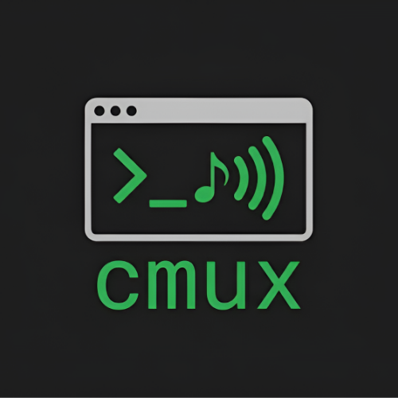
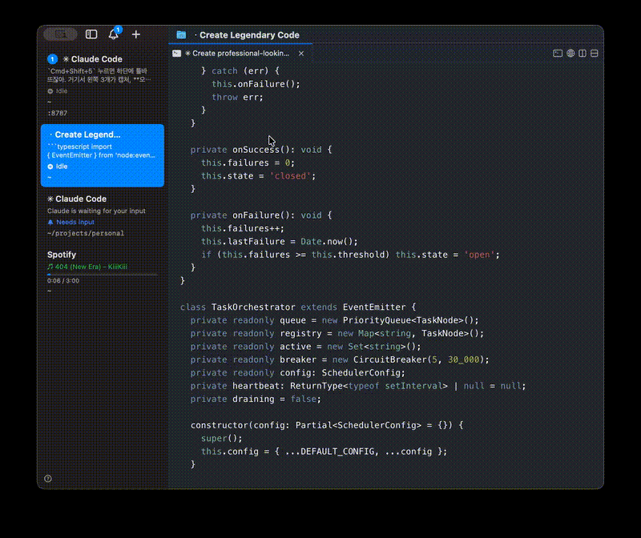
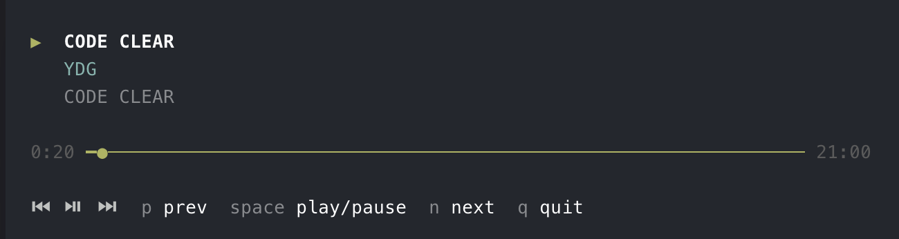

<p align="center">
  
</p>

<h1 align="center">cmux-spotify</h1>

<p align="center">
  A Spotify mini-player that lives inside <a href="https://cmux.dev">cmux</a>'s sidebar.
</p>

<p align="center">
  
  
  
  
</p>

<!-- demo GIF: uncomment when assets/demo.gif is added
<p align="center">
  
</p>
-->

## What it does

Creates a dedicated Spotify workspace at the bottom of your cmux sidebar.

**Sidebar** — always visible while you code:
- `♫ Track - Artist` in Spotify green (`#1DB954`) when playing
- `⏸ Track - Artist` in gray when paused
- Progress bar showing playback position
- Marquee scroll when the song title is too long

**Click into it** — interactive TUI player:
- Track, artist, album display with progress bar
- Keyboard controls: `space` play/pause, `n` next, `p` previous, `q` quit

<!-- TUI screenshot: uncomment when assets/tui-player.png is added
<p align="center">
  
</p>
-->

Automatically hides when Spotify is not running.

## Installation

### 1. Clone

```bash
git clone https://github.com/stoneHee99/cmux-spotify.git ~/projects/cmux-spotify
```

### 2. Launch

```bash
sh ~/projects/cmux-spotify/launch.sh
```

A "Spotify" workspace appears at the bottom of your cmux sidebar.

### 3. Auto-start on cmux launch

Add this to `~/.zshrc` (or `~/.bashrc`):

```bash
# cmux-spotify: auto-start Spotify workspace in cmux
if [ -n "$CMUX_WORKSPACE_ID" ] && ! pgrep -f spotify-tui.sh >/dev/null 2>&1; then
  sh ~/projects/cmux-spotify/launch.sh >/dev/null 2>&1 &
fi
```

Now every time you open cmux, the Spotify workspace is automatically created at the bottom.

## Keyboard controls (inside the TUI)

| Key | Action |
|---|---|
| `space` | Play / Pause |
| `n` | Next track |
| `p` | Previous track |
| `q` | Quit player |

## Platform support

| OS | Method | Requirements |
|---|---|---|
| macOS | AppleScript (`osascript`) | Spotify desktop app |
| Linux | [playerctl](https://github.com/altdesktop/playerctl) (MPRIS/D-Bus) | `playerctl`, Spotify desktop app |

### Linux: Install playerctl

```bash
# Ubuntu / Debian
sudo apt install playerctl

# Arch
sudo pacman -S playerctl

# Fedora
sudo dnf install playerctl
```

## How it works

`launch.sh` creates a cmux workspace running `spotify-tui.sh`, which does two things simultaneously:

1. **Updates the sidebar** — calls `cmux set-status` and `cmux set-progress` every second to show the current track and progress in the sidebar pill
2. **Renders a TUI** — draws an interactive player inside the workspace with progress bar and keyboard controls

Data is fetched using OS-native methods (AppleScript on macOS, playerctl on Linux) with a single call per cycle to minimize overhead. The display uses cursor repositioning instead of screen clearing to prevent flicker.

## Files

```
├── launch.sh         # Creates the Spotify workspace in cmux
├── spotify-tui.sh    # TUI player + sidebar updater
├── LICENSE
└── README.md
```

## License

MIT
